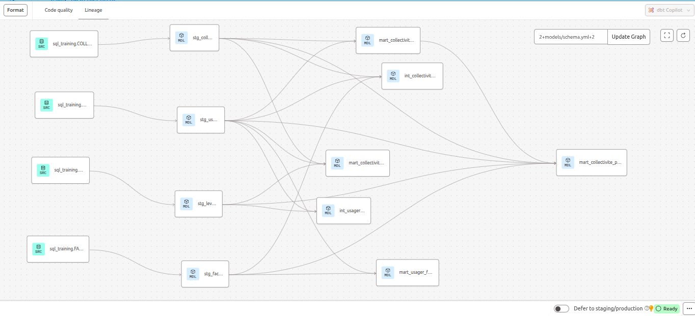

# 🚀 Migration SSIS → Snowflake + dbt


## 🌟 Objectif du projet

Ce projet personnel a pour objectif de démontrer comment moderniser un flux ETL traditionnel (par exemple développé avec SSIS) vers une architecture cloud-native basée sur Snowflake et dbt.

Dans un premier temps, je réalise des **tests exploratoires avec dbt connecté à Snowflake**, pour :
- Explorer la structure de dbt (models, seeds, snapshots, tests).
- Comprendre l’interaction avec Snowflake (chargement, transformation).
- Tester les fonctionnalités de transformation, documentation et validation des données.

Dans un second temps (prochaines étapes), je construirai un **cas pratique complet** basé sur des jeux de données simulés, incluant des processus d’intégration, de transformation et de reporting.

---

## 🛠️ Stack technique

- **dbt** (data build tool) — pour les transformations ELT, les tests, la documentation.
- **Snowflake** — comme entrepôt de données cloud.
- **GitHub** — pour versionner le code dbt et suivre les évolutions.

---

## 📂 Organisation du projet
```markdown
/models/
├── staging/                           → Nettoyage des sources brutes
│   ├── sql_training/                  → Spécifique au schéma source Snowflake
│   │   ├── stg_collectivite.sql
│   │   ├── stg_usager.sql
│   │   ├── stg_levees.sql
│   │   └── stg_factures.sql
│   └── sources.yml                    → Déclaration des sources Snowflake
│
├── intermediate/                      → Étapes intermédiaires (si besoin, sinon facultatif)
│   ├── int_usager_levees.sql         → Exemple : usager + déchets consolidés
│   └── int_collectivite_factures.sql → Exemple : collectivité + factures consolidées
│
├── marts/                             → Tables finales métiers
│   ├── core/                         → Cœur de données pour l'analyse
│   │   ├── mart_collectivite_usagers.sql
│   │   ├── mart_collectivite_dechets.sql
│   │   └── mart_usager_facturation.sql
│   └── reporting/                    → Tableaux de bord globaux
│       └── mart_collectivite_performance.sql
│
├── schema.yml                         → Documentation + tests pour les models (stg, int, mart)
└── README.md                          → (optionnel) Documentation projet / diagramme archi

```
## 🗺️ Schéma global (DAG)

Voici le graphe de dépendance complet de ce projet dbt, montrant les relations entre les sources, les modèles intermédiaires et les marts finaux.



